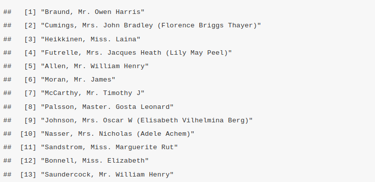

# Data Manipulation
## Basic Data Manipulation 
Sorting Data:

- Explanation of sorting data in R using order() and sort() functions.
- Demonstration of sorting data frames by one or more columns.

Basic Data Cleaning Techniques:

- Overview of common data cleaning tasks (e.g., handling missing data, removing duplicates).
- Demonstration of how to detect and manage missing values using is.na() and na.omit() functions.


### Introduction to Data Manipulation
Data Manipulation is the adjusting, organizing and transforming of the raw data is not a more useful and suitable format for data analysis. These are some of the reasons that make data manipulation mandatory in the data analysis process; 

1. **Improves the data quality**  
Raw data may be incomplete, messy, containing irrelevant information, errors ,or duplicates that need to be cleaned and rectified. This will ensure the data is reliable thereby preventing incorrect conclusions or decisions. 

2. **Making Data Usable** 
Sometimes data is collected from different sources that is not ready for analysis. Data Manipulation will transform the data into a structured and consistent format for easy analysis. 

3. **Enhancing Data Exploration**  
By cleaning the data, analysts explore the data thereby understanding different concepts of the data. 

4. **Enabling Complex Analysis**  
Some types of analysis require data to be in specific format or structure, for instance the time series analysis require data to be sorted out by date. 

5. **Supporting Decision Making**  
Data Manipulation ensures that the data that is fed into the system is timely, accurate and reliable for informed decision-making models and relevant reports
<br>

These are the key tasks in the data manipulation;

- **Cleaning**: by removing inaccurate and incomplete data entries.
- **Filtering** the data by selecting certain rows or columns based on a certain criteria. 
- **Reshaping**: Changing the structure of the data for instance pivoting.
- **Merging**: Combine multiple data sets into one. 
- **Transforming**: Modify existing data by mathematical or logical operations. 
- **Aggregation**: Summarizing the data by performing operations like sum,average and count. 

### Subsetting and Filtering Data:

**Subsetting** is a data management strategy that involves creating a coherent slice data from different data set for specific use cases. This topic will better be explained practically, therefore we will use the titanic data set. The data set contains information about the passengers on the Titanic, including their age, gender, passenger class, whether they survived and other details. Since the titanic dataset is absent in baseR, the  `titanic` library will be installed by;
```
install.packages("titanic")
```

load the library 
```{r}
library("titanic")
```

The data set will indexed using different indexing techniques such as indexing of a single element, row and column indexing. 

First we load the data set and view the first few records before indexing
```{r}
data("titanic_train")

titanic <- titanic_train 
head(titanic) # view the first few rows of the titanic data set
```

1. **Extract a row**
When subsetting to extract data for a single row the square brackets `[ ]` will be used with the position of the index you want to extract. Lets extract all the information of the 10th passenger.
```{r}
titanic[10, ] # note the comma after the index 10
```
Also, more indices can be subsetted in the format `[i:j, ]` where the `i` is the starting index while `j` is the ending index respectively. Lets extract the information by subsetting the titanic data from index 7 to 10. 
```{r}
titanic[7:10, ]
```
2. **Extract a column**  
When subsetting to extract data for a single column the square brackets `[ ]` will be used as before, with the position of the index or column name you want to extract. Lets extract all the information of the column `Name`.
```
titanic[, "Name"] # note the comma before "Name"
```


An index of the column can be used in place of the column name. For instance, the column, "PassengerId" is the first column therefore its index will be `1`. Lets subset the column by calling the index.
```
titanic[, 1] # note the comma before the column index
```


3. **Extracting a single element**  
A single element that has a defined position in a data frame, both the row index and the column name/index are called. 
```
dataframe[row_index, column index/name]
```

Lets extract the age of the Name of the fifth passenger. 
```{r}
titanic[5, "Name"]
```

Instead of using the column name. Lets use the column index. In the above context, the column "Name" appears at index(is the fourth column). 
```{r}
titanic[5, 4]
```


Subsetting a data set can be done by **filtering** data based on logical conditions to extract rows that meet certain criteria. They involve comparisons operators such as `>, <, ==, !=` or logical operators like `&`(and), `|`(or), `!` (not). 

In this titanic data set we:-

1. **Filter based on a single condition**
Lets find the passengers who survived on the titanic.
```{r}
survivors <- titanic[titanic$Survived == 1, ]
head(survivors) # view the first few rows of survivors
```
The above data set consists of titanic passengers who survived.

Who were the passengers who boarded the first class on the Titan?
```{r}
first_class_passengers <- titanic[titanic$Pclass == 1, ]
head(first_class_passengers)
```
The above examples, the extracted data set met a single condition. 

2. **Filtering based on Multiple Conditions**
Data can be subsetted by filtering based on more than one condition. To demonstrate this, lets find the female passengers who survived. Here there are two conditions;-

- the passenger must be a female,
- the passenger must have survived. 

The resultant data set must meet the above conditions
```{r}
female_survivors <- titanic[titanic$Sex == "female" & titanic$Survived == 1, ]

head(female_survivors) #view the first few rows 
```
Lets also add one more condition, the female survivor must be under 18. 
```{r}
minor_female_survivors <- titanic[titanic$Sex == "female" & 
                                    titanic$Survived == 1 &
                                    titanic$Age < 18, ] # comma should be after the conditons

head(minor_female_survivors)
```

3. **Filtering using Negation**  
The `!=` sign a logical operator that is used to negate a condition. Lets use it to find the passengers who did not survive. 
```{r}
non_survivors <- titanic[titanic$Survived != 1, ]
tail(non_survivors) # view the last few records 
```
Alternatively you can use 
```
non_survivors <- titanic[!titanic$Survived == 1, ]
```

Also, lets find the passengers who were not in the third class 
```{r}
not_third_class <- titanic[titanic$Pclass != 3, ]
head(not_third_class)
```

Alternatively
```
not_third_class <- titanic[!titanic$Pclass == 3, ]
```

### Sorting Data
Sorting is the ordering of elements in a data set (vectors, lists, matrix and data frames) based on a particular criteria. This is a fundamental operation data analysis, as it enables data organization in a meaningful way for easier visualization and interpretation. These are the several functions in Base R that are used in sorting;-

1. `sort()`  

- Lets create a vector v with five elements
- Sort the elements in a descending order

```{r}
v = c(43, 82, 11, 73, 34) # Create a vector
v1 = sort(v, decreasing = TRUE) #sort the elements in a descending order
v1
```

- to order the same vector in an ascending order the `decreasing` argument is set to `FALSE`. 
```{r}
v = c(43, 82, 11, 73, 34) # Create a vector
v2 = sort(v, decreasing = FALSE) #sort the elements in an ascending order
v2
```

- Also character vectors can be sorted in alphabetical order for instance lets sort the the names, `"Alice", "Charlie", "Bob"` in the alphabetical order. 
```{r}
names <- c("Alice", "Charlie", "Bob")
sorted_names <- sort(names)
sorted_names
```

- Alternatively, the names can be ordered in the reverse alphabetical order when the `decreasing` argument is set to `TRUE`.
```{r}
names <- c("Alice", "Charlie", "Bob", "Zach")
names_1 <- sort(names, decreasing = TRUE) # order in reverse alphabetical order
names_1
```

2. `order()`  

This function returns the indices that would sort the vectors. For instance lets sort the vector `v = c(43, 82, 11, 73, 34)` in an ascending order(from smallest to the largest). The smallest number in this case is 11, therefore, the `order()` function will return 1 while 82 is the largest(5th smallest) number in this case, it will be returned as 5.  

```{r}
v = c(43, 82, 11, 73, 34)
order(v, decreasing = FALSE)
```

<<<<**Add two more examples**>>>>

3. `rank()`

Returns of the rank of the element in a vector, list. The smallest element is ranked as 1(in this case its 11) while largest element is ranked last(82 is ranked 5 here)

```{r}
v = c(43, 82, 11, 73, 34)
rank(v, ties.method = "average", na.last = TRUE)
```

4. `rev()`

This function simply reverse the order of elements. The first element in a vector will be last while the last one will be first. 

```{r}
v = c(43, 82, 11, 73, 34)
rev(v)
```

5. **Sorting Data Frames**

A data frame can be sorted in descending/ascending order of a certain column. For instance, we will sort the titanic data set in the order of age in ascending order.

```{r}
titanic_by_age <- titanic[order(titanic$Age), ]
head(titanic_by_age)
```

Sorting the titanic data by age in descending order, `-` will be added infront of argument `titanic$Age` to be `-titanic$Age`

```{r}
titanic_by_age <- titanic[order(-titanic$Age), ] # note the - sign
head(titanic_by_age)
```

Also, dataframes can be sorted based by multiple columns. Lets sort the titanic data set by Passenger class (`Pclass`) in ascending order and by age in descending order at once.

```{r}
# Pclass in ascending order, Age in descending order
titanic_sorted_by_class_and_age <- titanic[order(titanic$Pclass, -titanic$Age), ]

head(titanic_sorted_by_class_and_age)
```

### Basic Data Cleaning
**Data Cleaning** is the process of fixing, removing incorrect, incomplete or otherwise problematic data from a data set. This is a crucial step in data analysis as it leads to more reliable analyses and insights. 

Here some data cleaning techniques used; 

1. **Handling Missing Data**  
The null values are identified by `is.na()` function. If there exists null values, they are removed by `na.omit()` function. The null values can also be replaced by appropriate substitutes  such as the mean, median, zero value or a placeholder, this is referred to as imputation.  
Lets create a vector `myvector` will null values, identify the null values, remove/impute them. 
```{r}
# Create a vector that has missing values
my_vector <- c(12, 43, NA, 32, 65, 11, NA, NA, 34, 98, 57) # NA is the missing value

# Identify existence of the null values
is.na(my_vector)

# Count the null values 
sum(is.na(my_vector))

# remove null values 
clean_vector <- na.omit(my_vector)
clean_vector

# impute missing values
my_vector[is.na(my_vector)] <- mean(my_vector, na.rm = TRUE)
my_vector
```


### Hands-on Exercises

## Data Manipulation with Dplyr
### Introduction to Dplyr package 
Dplyr is a package designed for data manipulation equipped with a set of intuitive functions to perform tasks like filtering rows, selecting columns, rearranging data and summarizing information. The package is part of a larger library, `tidyverse`. The **tidyverse** package is a package designed for data science that share an underlying design philosophy, grammar and data structures. The packages within the tidyverse are widely used for data manipulation, exploration, and visualization in R. Here are some of the core packages in tidyverse; 

- `ggplot2`
- `dplyr`
- `tidyr`
- `readr`
- `purrr`
- `tibble`

The tidyverse package is installed by 
```
install.packages("tidyverse")
```

To invoke the package into the system, the below command is invoked
```{r}
library(tidyverse)
```
In this course, we will discuss on `dplyr` since it is an essential tool in data analysis. If you want to use dplyr alone then it can be installed by; 
```
install.packages("dplyr")
```

To load the library into the system;
```{r}
library(dplyr)
```

<**Introduce the dplyr verbs**>


### Hands-on Exercises


